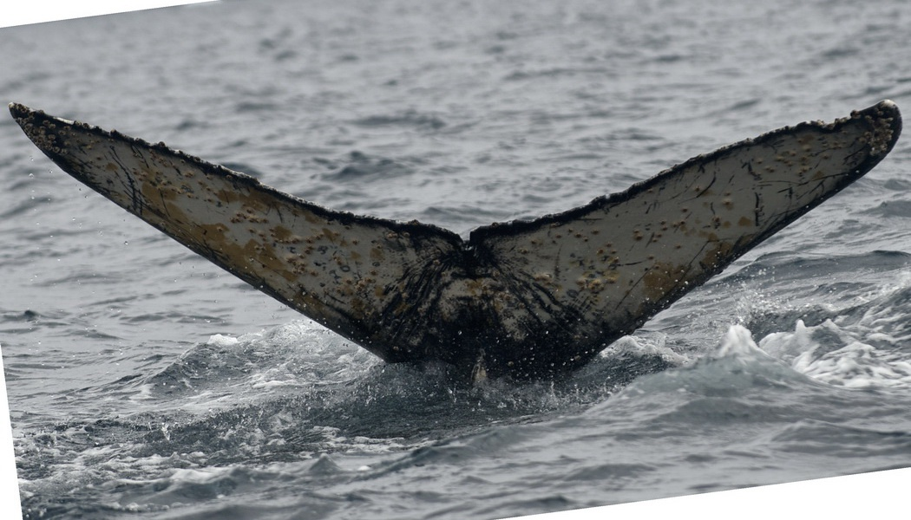
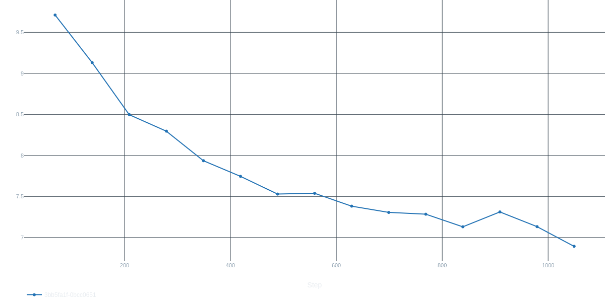
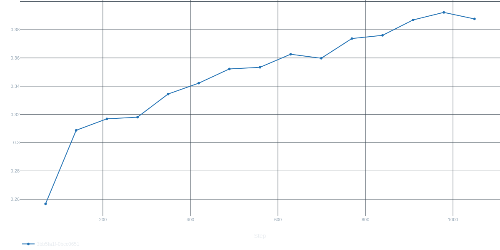

# Humpback Whale Identification

This is a reimplementation of
[notebook](https://www.kaggle.com/code/shivanshj/notebook574d6af37f) from
[Humpback Whale Identification Kaggle competition](https://www.kaggle.com/c/humpback-whale-identification/).

## Dataset

Data consists of whale images.
It has following structure:

```
dvc_store/data/
├── labels.json
├── sample_submission.csv
├── test/
├── train/
└── train.csv
```

`labels.json` --- set of known whales and their numerical IDs (generated on setup);

`train` and `test` --- folders with `.jpg` images;

`train.csv` --- table which contains image file name, whale ID and (after setup) a flag which defines the dataset this whale belongs to (train or val).

**Note:** some of the images can be gray colored.

### Image example



## Output

The task is to find 5 possible options to guess target whale ID.

## Metric

We will use `CrossEntropyLoss` loss function on logits taken from ArcFace module.
Target metric is `RetrievalMAP(top_k=5)`.

**Note:** I reimplement MAP metric because of memory leak in `torchmetrics` implementation.

## Usage

### Setup

```bash
git clone https://github.com/mug-4-ur-pc/humpback-whale-identification.git
cd humpback-whale-identification/
poetry install --with dev
eval $(poetry env init)
pre-commit install
```

**Note:** I use local DVC storage that is why you should download dataset manually.
Unzip it to `dvc_store/data/` fplder.

To split data into train and val and get whale IDs encodings run

```bash
whale setup
```

#### Flags:

- `-c`, `--config_dir` --- train config root directory.

### About configuration

There are two configurations:

- training --- training config which enter point `config/main.yaml`
- inference --- inference config which is located at `config/infer.yaml`

You can specify train config root dir or inference config file by using flags.

### Training

To run train execute:

```bash
whale train
```

Don't forget to set up `mlflow_uri` in `config/log/default.yaml` config file.

**Note:** train will not start if you have uncommited changes
except if you in debug mode. This is necessary because commit id is used
to create run name. Run name also contains hash of your config.

#### Flags

- `-c`, `--config_dir` --- train config root directory.

### Train process example

#### Validation loss



#### Validation metric



### Exporting

To export trained checkpoint run:

```bash
whale export <ckpt_path> --format=<format>
```

#### Available_formats:

- `pt` --- PyTorch;
- `onnx` --- ONNX format;
- `engine` --- TensorRT engine.

#### Flags

- `-c`, `--config_dir` --- train config root directory;
- `-d`, `--dst` --- output path (if not specified output will be stored near input model checkpoint);
- `-f`, `--format` --- output format.

You can also use format specific flags.

#### ONNX

- `--input_names` --- list of input names.
- `--output_names` --- list of output names.
- `--dynamic_axes` --- dynamic axes specification.
- `--opset_version` --- ONNX opset version.

#### TensorRT

- `--fp16_mode` --- use fp16 precision.

### Inference

Run next command:

```bash
whale infer <input_path>
```

or

```bash
python3 humpback_whale.src.infer.py <input_path>
```

if you want to reduce amount of imported modules.

Input path can be a single file. Then top k whales will printed as output.

Another option is to pass a directory with images which will result
in csv file creation. You can specify path of this file by using flag `-o` or `--output_path`.

To choose the model for inference edit model_path field in inference config.
You can use your own config by using flag `-c`.

You can look at output example [here](./examples/predictions.csv).
